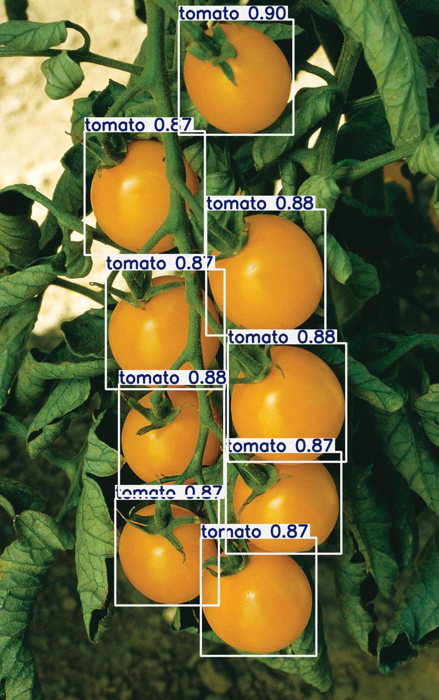
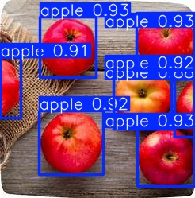

# FruitDetection

Курсовой проект по обнаружению овощей и фруктов на изображениях с помощью
нейронной сети YOLO11.

Система распознаёт яблоки, огурцы и помидоры, отмечает найденные объекты
рамками и показывает уверенность модели.

<p align="center">


</p>

## Возможности

- загрузка изображения через веб-интерфейс;
- обнаружение нескольких объектов на одном изображении;
- распознавание яблок, огурцов и помидоров;
- отображение класса, рамки и уверенности для каждого объекта;
- обработка изображений через Telegram-бота;
- API для выполнения инференса;
- запуск всех компонентов через Docker Compose;
- проксирование веб-приложения через Caddy.

## Модель

Для обнаружения объектов используется модель `YOLO11s`.

Модель обучалась в течение 100 эпох на датасете, содержащем более
7000 изображений. В обучающую выборку также были добавлены негативные
примеры — изображения без объектов целевых классов.

Распознаваемые классы:

- яблоко
- огурец
- помидор

[Блокнот с обучением модели](https://colab.research.google.com/)

## Состав проекта

Проект состоит из нескольких компонентов:

- модель обнаружения объектов;
- API для обработки изображений;
- веб-интерфейс;
- Telegram-бот;
- Caddy в качестве обратного прокси;
- Docker Compose для совместного запуска сервисов.

## Демонстрация

Веб-приложение и Telegram-бот использовались для демонстрации работы
курсового проекта.

> Публичные экземпляры проекта были доступны до 2 июня 2026 года
> и сейчас могут быть отключены.

## Запуск

Клонируйте репозиторий:

```bash
git clone https://github.com/Whiox/FruitDetection.git
cd FruitDetection
```

Структура файла `.env`:

```env
TELEGRAM_TOKEN=
```

```bash
docker compose up --build
```

## Техническое задание

Требования к системе, сценарии использования и описание проекта приведены
в [техническом задании](./ТЗ.pdf).

## Стек

- Python
- YOLO11
- Ultralytics
- HTML, CSS и JavaScript
- Telegram Bot API
- Docker Compose
- Caddy

## Статус проекта

Проект выполнен в рамках курсовой работы. Требования технического
задания реализованы.
